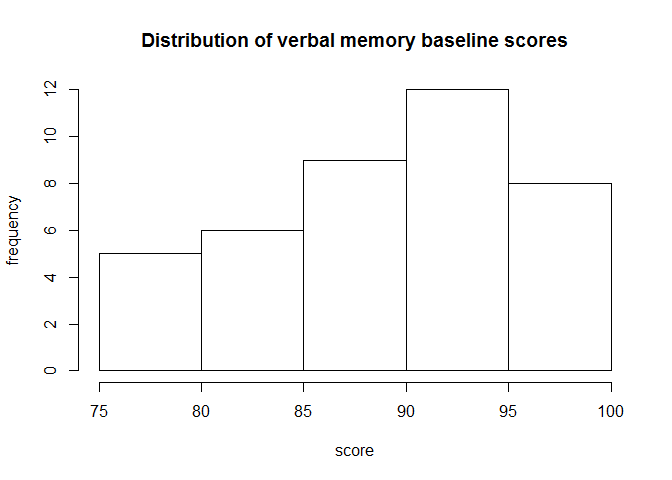
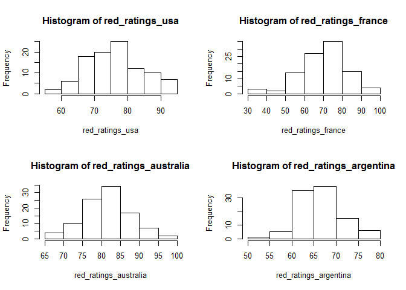
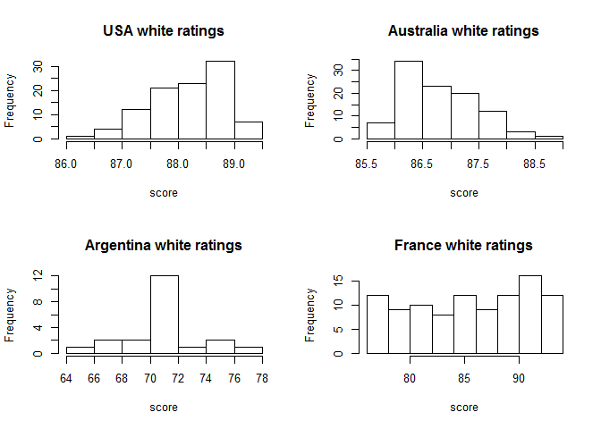
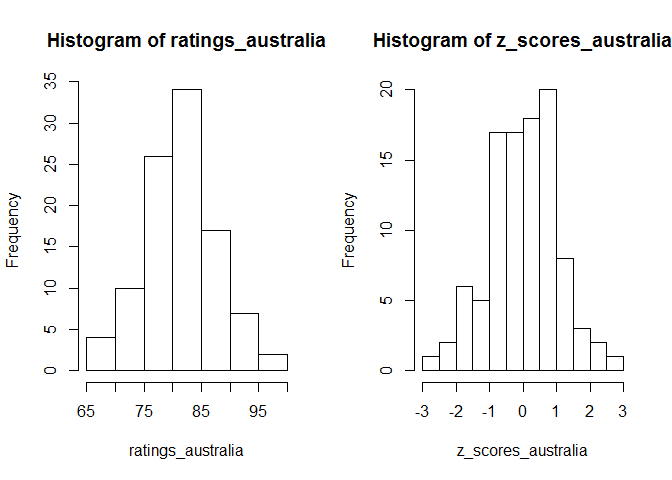
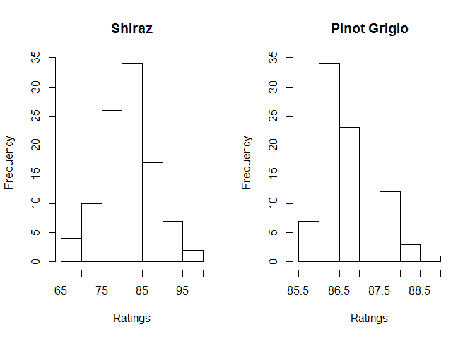
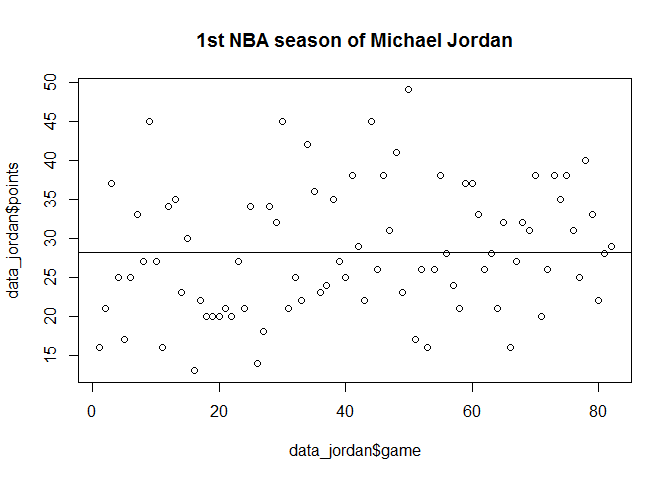

-   [1, Variables](#variables)
-   [2, Histograms and Distributions](#histograms-and-distributions)
-   [3, Scales of Measurement](#scales-of-measurement)
-   [4, Measures of Central Tendency](#measures-of-central-tendency)
-   [5, Measures of Variability](#measures-of-variability)

------------------------------------------------------------------------

**Foreword**

-   Output options: the 'tango' syntax and the 'readable' theme.
-   Snippets and results.

------------------------------------------------------------------------

1, Variables
------------

**Nominal variables in R**

``` r
# Create a numeric vector with the identifiers of the participants of your survey
participants_1 <- c(2, 3, 5, 7, 11, 13, 17)

# Check what type of values R thinks the vector consists of
class(participants_1)
```

    ## [1] "numeric"

``` r
# Transform the numeric vector to a factor vector
participants_2 <- factor(participants_1)

# Check what type of values R thinks the vector consists of now
class(participants_2)
```

    ## [1] "factor"

**Ordinal variables in R**

``` r
# Create a vector of temperature observations
temperature_vector <- c('High', 'Low', 'High', 'Low', 'Medium')
temperature_vector
```

    ## [1] "High"   "Low"    "High"   "Low"    "Medium"

``` r
# Specify that they are ordinal variables with the given levels
factor_temperature_vector <- factor(temperature_vector, order = TRUE, levels = c('Low', 'Medium', 'High'))
factor_temperature_vector
```

    ## [1] High   Low    High   Low    Medium
    ## Levels: Low < Medium < High

**Interval and Ratio variables in R**

``` r
# Assign to the variable 'longitudes' a vector with the longitudes
# This is an interval variable.
longitudes <- c(10, 20, 30, 40)

# Assign the times it takes for an athlete to run 100 meters to the variable 'chronos'
# This is a ratio variable.
chronos <- c(10.60, 10.12, 9.58, 11.1)
```

2, Histograms and Distributions
-------------------------------

**Creating histograms in R**

``` r
# Print the data set in the console
head(impact)
```

    ##   subject condition verbal_memory_baseline visual_memory_baseline
    ## 1       1   control                     95                     88
    ## 2       2   control                     90                     82
    ## 3       3   control                     87                     77
    ## 4       4   control                     84                     72
    ## 5       5   control                     92                     77
    ## 6       6   control                     89                     79
    ##   visual.motor_speed_baseline reaction_time_baseline
    ## 1                       35.29                   0.42
    ## 2                       31.47                   0.63
    ## 3                       30.87                   0.56
    ## 4                       41.87                   0.66
    ## 5                       33.28                   0.56
    ## 6                       40.73                   0.81
    ##   impulse_control_baseline total_symptom_baseline verbal_memory_retest
    ## 1                       11                      0                   97
    ## 2                        7                      0                   86
    ## 3                        8                      0                   90
    ## 4                        7                      0                   85
    ## 5                        7                      1                   87
    ## 6                        6                      0                   91
    ##   visual_memory_retest visual.motor_speed_retest reaction_time_retest
    ## 1                   86                     35.61                 0.65
    ## 2                   80                     37.01                 0.49
    ## 3                   79                     20.15                 0.75
    ## 4                   70                     33.26                 0.19
    ## 5                   77                     28.34                 0.59
    ## 6                   85                     33.47                 0.48
    ##   impulse_control_retest total_symptom_retest
    ## 1                     10                    0
    ## 2                      7                    0
    ## 3                      9                    0
    ## 4                      8                    0
    ## 5                      8                    1
    ## 6                      5                    0

``` r
# Use the describe() function to see some summary information per variable
#describe(impact)
summary(impact)
```

    ##     subject       condition         verbal_memory_baseline
    ##  Min.   : 1.00   Length:40          Min.   :75.00         
    ##  1st Qu.:10.75   Class :character   1st Qu.:85.00         
    ##  Median :20.50   Mode  :character   Median :91.00         
    ##  Mean   :20.50                      Mean   :89.75         
    ##  3rd Qu.:30.25                      3rd Qu.:95.00         
    ##  Max.   :40.00                      Max.   :98.00         
    ##  visual_memory_baseline visual.motor_speed_baseline reaction_time_baseline
    ##  Min.   :59.00          Min.   :26.29               Min.   :0.4200        
    ##  1st Qu.:68.75          1st Qu.:31.59               1st Qu.:0.5675        
    ##  Median :75.00          Median :33.50               Median :0.6500        
    ##  Mean   :74.88          Mean   :34.03               Mean   :0.6670        
    ##  3rd Qu.:81.25          3rd Qu.:36.44               3rd Qu.:0.7325        
    ##  Max.   :91.00          Max.   :41.87               Max.   :1.2000        
    ##  impulse_control_baseline total_symptom_baseline verbal_memory_retest
    ##  Min.   : 2.000           Min.   :0.00           Min.   :59          
    ##  1st Qu.: 7.000           1st Qu.:0.00           1st Qu.:74          
    ##  Median : 8.500           Median :0.00           Median :85          
    ##  Mean   : 8.275           Mean   :0.05           Mean   :82          
    ##  3rd Qu.:10.000           3rd Qu.:0.00           3rd Qu.:91          
    ##  Max.   :12.000           Max.   :1.00           Max.   :97          
    ##  visual_memory_retest visual.motor_speed_retest reaction_time_retest
    ##  Min.   :54.00        Min.   :20.15             Min.   :0.1900      
    ##  1st Qu.:66.75        1st Qu.:30.33             1st Qu.:0.5575      
    ##  Median :72.00        Median :35.15             Median :0.6500      
    ##  Mean   :71.90        Mean   :35.83             Mean   :0.6730      
    ##  3rd Qu.:79.00        3rd Qu.:39.41             3rd Qu.:0.7325      
    ##  Max.   :86.00        Max.   :60.77             Max.   :1.3000      
    ##  impulse_control_retest total_symptom_retest
    ##  Min.   : 1.00          Min.   : 0.00       
    ##  1st Qu.: 5.00          1st Qu.: 0.00       
    ##  Median : 7.00          Median : 7.00       
    ##  Mean   : 6.75          Mean   :13.88       
    ##  3rd Qu.: 9.00          3rd Qu.:27.00       
    ##  Max.   :12.00          Max.   :43.00

``` r
# Select the variable 'verbal_memory_baseline' from the 'impact' data.frame and assign it to the variable 'verbal_baseline'
verbal_baseline <- impact$verbal_memory_baseline
verbal_baseline
```

    ##  [1] 95 90 87 84 92 89 78 97 93 90 89 97 79 86 85 85 98 95 96 92 79 85 97
    ## [24] 89 75 75 84 93 88 97 93 96 84 89 95 95 97 95 92 95

``` r
# Plot a histogram of the verbal_baseline variable that you have just created
hist(verbal_baseline, main = 'Distribution of verbal memory baseline scores', xlab = 'score', ylab = 'frequency')
```

<center></center>

**Let us go wine tasting (red wine)**

``` r
# Read in the data set and assign to the object
red_wine_data <- readWorksheetFromFile('A Hands-on Introduction to Statistics with R.xls', sheet = 'red_wine_data', header = TRUE, startCol = 1, startRow = 1)

# This will print the data set in the console
head(red_wine_data)
```

    ##   subject condition Ratings
    ## 1       1 Australia      77
    ## 2       2 Australia      82
    ## 3       3 Australia      75
    ## 4       4 Australia      92
    ## 5       5 Australia      83
    ## 6       6 Australia      75

``` r
# Print basic statistical properties of the red_wine_data data.frame. Use the describe() function
#describe(red_wine_data)
summary(red_wine_data)
```

    ##     subject       condition            Ratings     
    ##  Min.   :  1.0   Length:400         Min.   :39.00  
    ##  1st Qu.:100.8   Class :character   1st Qu.:67.00  
    ##  Median :200.5   Mode  :character   Median :74.00  
    ##  Mean   :200.5                      Mean   :73.94  
    ##  3rd Qu.:300.2                      3rd Qu.:81.00  
    ##  Max.   :400.0                      Max.   :98.00

``` r
# Split the data.frame in subsets for each country and assign these subsets to the variables below
red_usa <- subset(red_wine_data, red_wine_data$condition == 'USA')
red_france <- subset(red_wine_data, red_wine_data$condition == 'France')
red_australia <- subset(red_wine_data, red_wine_data$condition == 'Australia')
red_argentina <- subset(red_wine_data, red_wine_data$condition == 'Argentina')

# Select only the Ratings variable for each of these subsets and assign them to the variables below
red_ratings_usa <- red_usa$Ratings
red_ratings_france <- red_france$Ratings
red_ratings_australia <- red_australia$Ratings
red_ratings_argentina <- red_argentina$Ratings

## Create a 2 by 2 matrix of histograms
# Organize the histograms so that they are structured in a 2 by 2 matrix.
par(mfrow = c(2,2))

# Plot four histograms, one for each subject
hist(red_ratings_usa)
hist(red_ratings_france)
hist(red_ratings_australia)
hist(red_ratings_argentina)
```

<center></center>

**Let us go wine tasting (white wine)**

``` r
# Read in the data set and assign to the object
white_wine_data <- readWorksheetFromFile('A Hands-on Introduction to Statistics with R.xls', sheet = 'white_wine_data', header = TRUE, startCol = 1, startRow = 1)

# This will print the data set in the console
head(white_wine_data)
```

    ##   condition Ratings
    ## 1 Australia    85.6
    ## 2 Australia    85.6
    ## 3 Australia    85.6
    ## 4 Australia    85.6
    ## 5 Australia    85.6
    ## 6 Australia    85.6

``` r
# Assign the scores for each country to a variable
white_ratings_france <- subset(white_wine_data, white_wine_data$condition == 'France')$Ratings
white_ratings_argentina <- subset(white_wine_data, white_wine_data$condition == 'Argentina')$Ratings
white_ratings_australia <- subset(white_wine_data, white_wine_data$condition == 'Australia')$Ratings
white_ratings_usa <- subset(white_wine_data, white_wine_data$condition == 'USA')$Ratings

# Plot a histogram for each of the countries
# Organize the histograms so that they are structured in a 2 by 2 matrix.
par(mfrow = c(2,2))

hist(white_ratings_usa, main = 'USA white ratings', xlab = 'score')
hist(white_ratings_australia, main = 'Australia white ratings', xlab = 'score')
hist(white_ratings_argentina, main = 'Argentina white ratings', xlab = 'score')
hist(white_ratings_france, main = 'France white ratings', xlab = 'score')
```

<center></center>

3, Scales of Measurement
------------------------

**Converting a distribution to Z-scale**

``` r
# Read in the data set and assign to the object
ratings_australia <- readWorksheetFromFile('A Hands-on Introduction to Statistics with R.xls', sheet = 'ratings_australia', header = TRUE, startCol = 1, startRow = 1)

ratings_australia <- as.vector(ratings_australia$ratings_australia)
```

``` r
# Print the ratings for the Australian red wine
ratings_australia
```

    ##   [1] 77 82 75 92 83 75 84 86 85 79 92 84 77 65 89 81 81 88 87 85 87 86 82
    ##  [24] 67 85 81 80 71 78 84 91 80 84 81 71 78 78 81 89 86 80 79 86 85 76 76
    ##  [47] 84 86 80 87 84 77 83 73 91 95 78 74 85 80 98 81 86 81 76 82 68 91 82
    ##  [70] 96 84 76 85 74 72 83 78 81 82 77 77 80 89 70 85 83 88 79 84 83 77 89
    ##  [93] 89 86 92 85 72 77 72 78

``` r
# Convert these ratings to Z-scores. Use the `scale()` function
z_scores_australia <- scale(ratings_australia)

# Plot both the original data and the scaled data in histograms next to each other
par(mfrow = c(1,2))

# Plot the histogram for the original scores
hist(ratings_australia)

# Plot the histogram for the Z-scores
hist(z_scores_australia)
```

<center></center>

4, Measures of Central Tendency
-------------------------------

**The mean of a Fibonacci sequence**

``` r
# create a vector that contains the Fibonacci elements
fibonacci <- c(0, 1, 1, 2, 3, 5, 8, 13) 

# calculate the mean manually. Use the sum() and the length() functions
mean <- sum(fibonacci)/length(fibonacci)
mean
```

    ## [1] 4.125

``` r
# calculate the mean the easy way
mean_check <- mean(fibonacci)
mean_check
```

    ## [1] 4.125

**Setting up histograms**

``` r
# Read in the data set and assign to the object
wine_data <- readWorksheetFromFile('A Hands-on Introduction to Statistics with R.xls', sheet = 'wine_data', header = TRUE, startCol = 1, startRow = 1)

head(wine_data)
```

    ##   condition Ratings
    ## 1       Red      77
    ## 2       Red      82
    ## 3       Red      75
    ## 4       Red      92
    ## 5       Red      83
    ## 6       Red      75

``` r
# create the two subsets
red_wine <- subset(wine_data, wine_data$condition == 'Red')
white_wine <- subset(wine_data, wine_data$condition == 'White')

# Plot the histograms of the ratings of both subsets
par(mfrow = c(1,2))
hist(red_wine$Ratings, main = 'Shiraz', xlab = 'Ratings')
hist(white_wine$Ratings, main = 'Pinot Grigio', xlab = 'Ratings')
```

<center></center>

**Robustness to outliers**

``` r
# create the outlier and add it to the dataset
outlier <- data.frame(condition = 'Red', Ratings = 0)

red_wine_extreme <- rbind(red_wine, outlier)

# calculate the difference in means and display it afterwards
diff_means <- mean(red_wine$Ratings) - mean(red_wine_extreme$Ratings)

diff_means
```

    ## [1] 0.8093069

``` r
# calculate the difference in medians and display it afterwards
diff_medians <- median(red_wine$Ratings) - median(red_wine_extreme$Ratings)

diff_medians
```

    ## [1] 0

5, Measures of Variability
--------------------------

**Michael Jordan's first NBA season - Global overview**

``` r
# Read in the data set and assign to the object
data_jordan <- readWorksheetFromFile('A Hands-on Introduction to Statistics with R.xls', sheet = 'data_jordan', header = TRUE, startCol = 1, startRow = 1)

head(data_jordan)
```

    ##   game points
    ## 1    1     16
    ## 2    2     21
    ## 3    3     37
    ## 4    4     25
    ## 5    5     17
    ## 6    6     25

``` r
# Make a scatterplot of the data on which a horizontal line with height equal to the mean is drawn.
mean_jordan <- mean(data_jordan$points)
plot(data_jordan$game, data_jordan$points,main = '1st NBA season of Michael Jordan')

abline(h = mean_jordan)
```

<center></center>

**Michael Jordan's first NBA season - Calculate the variance manually**

``` r
# Calculate the differences with respect to the mean 
diff <- data_jordan$points - mean(data_jordan$points)

# Calculate the squared differences
squared_diff <- diff^2

# Combine all pieces of the puzzle in order to acquire the variance
variance <- sum(squared_diff)/(length(data_jordan$points) - 1)
variance
```

    ## [1] 66.73427

``` r
# Compare your result to the correct solution. You can find the correct solution by calculating it with the `var()` function.
var(data_jordan$points)
```

    ## [1] 66.73427
