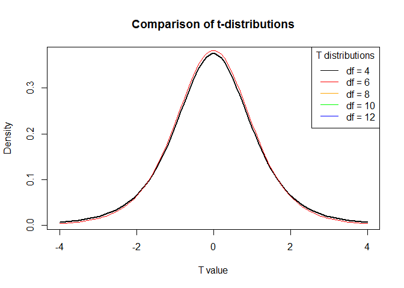
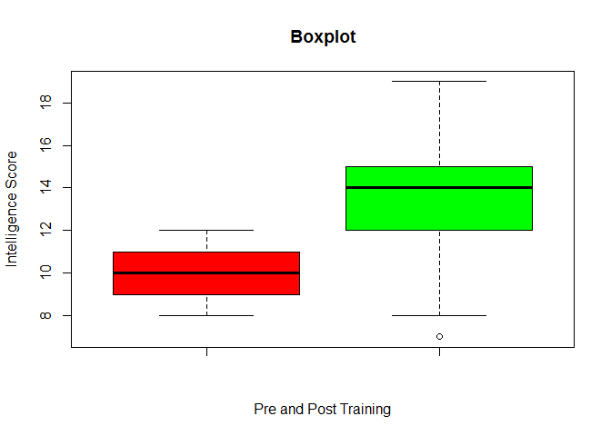
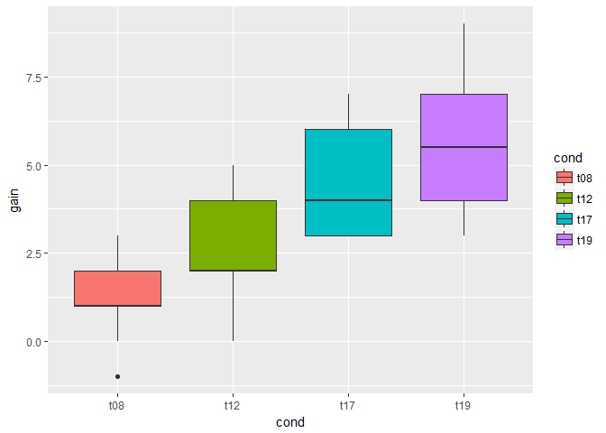

-   [1, Introduction to t-tests](#introduction-to-t-tests)
-   [2, Independent t-tests](#independent-t-tests)

------------------------------------------------------------------------

**Foreword**

-   Output options: the 'tango' syntax and the 'readable' theme.
-   Snippets and results.

------------------------------------------------------------------------

1, Introduction to t-tests
--------------------------

-   Test p-values for significance with z-tests, t-tests.
-   Single sample t-test: group of people from a particular geographic region perform on a well-known test of intelligence. In particular, you are interested in finding out whether or not this group scores significantly higher than the overall population on an IQ test. This is a form of Null Hypothesis Significance Testing (NHST), where the null hypothesis is that there's no difference between this group and the overall population.
-   Dependent t-test: single group of voters to rate their likelihood of voting for the candidate before the speech and again after the speech; understand if voters from a particular neighborhood are likely to vote differently when compared to the overall
    voting population.
-   Independent t-test: significant difference in preferences between these two groups; compare liberals and convervatives.
-   t-distribution, observed value, expected value, standard error.

**Generate density plots of different t-distributions**

``` r
# Generate a vector of 100 values between -4 and 4
x <- seq(-4, 4, length = 100)

# Simulate the t-distribution
y_1 <- dt(x, 4)
y_2 <- dt(x, 6)
y_3 <- dt(x, 8)
y_4 <- dt(x, 10)
y_5 <- dt(x, 12)

# Plot the t-distributions
plot(x, y_1, type = 'l', lwd = 2, xlab = 'T value', ylab = 'Density', main = 'Comparison of t-distributions')

lines(x, y_2, col = 'red')
#lines(x, y_3, col = 'orange')
#lines(x, y_4, col = 'green')
#lines(x, y_5, col = 'blue')

# Add a legend
legend('topright', c('df = 4', 'df = 6', 'df = 8', 'df = 10', 'df = 12'), title = 'T distributions', col = c('black', 'red', 'orange', 'green', 'blue'), lty = 1)
```

<center></center>

**The working memory dataset**

Conduct a dependent (or paired) t-test on the "working memory" dataset. This dataset consists of the intelligence scores for subjects before and after training, as well as for a control group. Our goal is to assess whether intelligence training results in significantly different intelligence scores for the individuals.

The observations of individuals before and after training are two samples from the same group at different points in time, which calls for a dependent t-test. This will test whether or not the difference in mean intelligence scores before and after training are significant.

``` r
# Print the data set in the console
head(wm)
```

    ##   cond pre post gain train
    ## 1  t08   8    9    1     1
    ## 2  t08   8   10    2     1
    ## 3  t08   8    8    0     1
    ## 4  t08   8    7   -1     1
    ## 5  t08   9   11    2     1
    ## 6  t08   9   10    1     1

``` r
library(Hmisc)

# Create a subset for the data that contains information on those subject who trained
wm_t <- subset(wm, wm$train == 1)

 # Summary statistics 
describe(wm_t)
```

    ## wm_t 
    ## 
    ##  5  Variables      80  Observations
    ## ---------------------------------------------------------------------------
    ## cond 
    ##        n  missing distinct 
    ##       80        0        4 
    ##                               
    ## Value       t08  t12  t17  t19
    ## Frequency    20   20   20   20
    ## Proportion 0.25 0.25 0.25 0.25
    ## ---------------------------------------------------------------------------
    ## pre 
    ##        n  missing distinct     Info     Mean      Gmd 
    ##       80        0        5    0.955    10.03    1.551 
    ##                                         
    ## Value          8     9    10    11    12
    ## Frequency     12    20    19    12    17
    ## Proportion 0.150 0.250 0.238 0.150 0.212
    ## ---------------------------------------------------------------------------
    ## post 
    ##        n  missing distinct     Info     Mean      Gmd      .05      .10 
    ##       80        0       13    0.984    13.51     2.87     9.95    10.00 
    ##      .25      .50      .75      .90      .95 
    ##    12.00    14.00    15.00    17.00    18.00 
    ##                                                                       
    ## Value          7     8     9    10    11    12    13    14    15    16
    ## Frequency      1     1     2     5     8    11    11    15     8     9
    ## Proportion 0.012 0.012 0.025 0.062 0.100 0.138 0.138 0.188 0.100 0.112
    ##                             
    ## Value         17    18    19
    ## Frequency      4     2     3
    ## Proportion 0.050 0.025 0.038
    ## ---------------------------------------------------------------------------
    ## gain 
    ##        n  missing distinct     Info     Mean      Gmd      .05      .10 
    ##       80        0       10    0.975    3.487    2.415      0.0      1.0 
    ##      .25      .50      .75      .90      .95 
    ##      2.0      3.0      5.0      6.1      7.0 
    ##                                                                       
    ## Value         -1     0     1     2     3     4     5     6     7     9
    ## Frequency      2     3     7    18    12    16     6     8     6     2
    ## Proportion 0.025 0.038 0.088 0.225 0.150 0.200 0.075 0.100 0.075 0.025
    ## ---------------------------------------------------------------------------
    ## train 
    ##        n  missing distinct     Info     Mean      Gmd 
    ##       80        0        1        0        1        0 
    ##              
    ## Value       1
    ## Frequency  80
    ## Proportion  1
    ## ---------------------------------------------------------------------------

``` r
# Create a boxplot with pre- and post-training groups 
boxplot(wm_t$pre, wm_t$post, main = "Boxplot", xlab = "Pre and Post Training", ylab = "Intelligence Score", col = c("red", "green"))
```

<center></center>

**Performing dependent t-tests manually in R (1)**

Conducting a dependent t-test, also known as a paired t-test, requires the following steps:

-   Define null and alternative hypotheses
-   Decide significance level *α*
-   Compute observed t-value
-   Find critical value
-   Compare observed value to critical value

We're performing a Null Hypothesis Significance Test (NHST), so our null hypothesis is that there's no effect (i.e. training has no impact on intelligence scores). The alternative hypothesis is that training results in signficantly different  intelligence scores. We'll use a significance level of 0.05, which is very common in statistics.

Compute the observed t-value.

``` r
# Define the sample size
n <- dim(wm_t)[1]

# Calculate the degrees of freedom
df <- n - 1

 # Find the critical t-value
t_crit <- abs(qt(0.025, df))

# Calculate the mean of the difference in scores. The differences are already in the dataset under the column 'gain'.
mean_diff <- sum(wm_t$gain)/n

# Calculate the standard deviation
xdt <- sum(wm_t$gain^2)
xdt2 <- xdt/n
sd_diff2 <- sqrt((xdt - xdt2)/(n - 1))
sd_diff <- sqrt((sum(wm_t$gain^2) - ((sum(wm_t$gain))^2/n))/(n - 1))
sd_diff2
```

    ## [1] 4.091149

``` r
sd_diff
```

    ## [1] 2.152383

**Performing dependent t-tests manually in R (2)**

Now that we've determined our null and alternative hypotheses, decided on a significance level, and computed our observed t-value, all that remains is to calculate the critical value for this test and compare it to our observed t-value. This will tell us whether we have sufficient evidence to reject our null hypothesis. We'll even go one step further and compute an effect size with Cohen's d!

The critical value is the point on the relevant t-distribution that determines whether the value we observed is extreme enough to warrant rejecting the null hypothesis. Recall that a t-distribution is defined by its degrees of freedom, which in turn is equal to the sample size minus 1. In this example, we have 80 subjects so the relevant t-distribution has 79 degrees of freedom.

We're performing a two-tailed t-test in this situation since we care about detecting a significant effect in either the positive or negative direction. In other words, we want to know if training significantly increases or decreases intelligence, however, given that our observed t-value is positive (14.49) the right-hand is the only relevant value here.

Furthermore, since our desired significance level (i.e. alpha) is 0.05, our critical value is the point on our t-distribution at which 0.025 (0.05 / 2) of its total area of 1 is to the right and thus 0.975 (1 - 0.025) of its total area is to the left.

This point is called the 0.975 quantile and is computed for a
t-distrbution.

``` r
# The variables from the previous exercise are still preloaded, type ls() in the console to see them
n <- dim(wm_t)[1]
df <- n - 1
t_crit <- abs(qt(0.025, df))
mean_diff <- sum(wm_t$gain)/n
sd_diff <- sqrt((sum(wm_t$gain^2) - ((sum(wm_t$gain))^2/n))/(n - 1))

# Calculate the t-value for this test
t_value <- mean_diff/(sd_diff/sqrt(n))

# Check whether or not the mean difference is statistically significant
t_value
```

    ## [1] 14.49238

``` r
t_crit
```

    ## [1] 1.99045

``` r
# Calculate the confidence interval
conf_upper <- mean_diff + t_crit * (sd_diff/sqrt(n))
conf_lower <- mean_diff - t_crit * (sd_diff/sqrt(n))
conf_upper
```

    ## [1] 3.966489

``` r
conf_lower
```

    ## [1] 3.008511

``` r
# Calculate Cohen's d
cohens_d <- mean_diff/sd_diff
cohens_d
```

    ## [1] 1.620297

**Letting R do all the dirty work: Dependent t-tests**

The `CohensD` function (not showns).

Cohen's d Determine that the difference pre- and post-training is statistically significant; and the effect size, meaning the effect of training on intelligence gains particularly strong or not.

Cohen's d is unbiased by sample size. Cohen's d provides a standardized difference between two means. Cohen's d is calculated by subtracting one group mean from the other, then dividing by the pooled standard deviation.

``` r
# Conduct a paired t-test using the t.test function
t.test(wm_t$post, wm_t$pre, paired = TRUE)
```

    ## 
    ##  Paired t-test
    ## 
    ## data:  wm_t$post and wm_t$pre
    ## t = 14.492, df = 79, p-value < 2.2e-16
    ## alternative hypothesis: true difference in means is not equal to 0
    ## 95 percent confidence interval:
    ##  3.008511 3.966489
    ## sample estimates:
    ## mean of the differences 
    ##                  3.4875

``` r
# Calculate Cohen's d
library(lsr)

cohensD(wm_t$post, wm_t$pre, method = 'paired')
```

    ## [1] 1.620297

2, Independent t-tests
----------------------

An independent t-test is appropriate when you want to compare the the means for two independent groups.

**Preliminary statistics**

For independent t-tests you will revisit the working memory dataset from the previous chapter. In this dataset, subjects were randomly assigned to four different training groups that trained for 8, 12, 17 and 19 days.

``` r
# Read in the data set and assign to the object
wm_t <- readWorksheetFromFile('A Hands-on Introduction to Statistics with R.xls', sheet = 'wm_t', header = TRUE, startCol = 1, startRow = 1)

# This will print the data set in the console
head(wm_t)
```

    ##   cond pre post gain train
    ## 1  t08   8    9    1     1
    ## 2  t08   8   10    2     1
    ## 3  t08   8    8    0     1
    ## 4  t08   8    7   -1     1
    ## 5  t08   9   11    2     1
    ## 6  t08   9   10    1     1

Add statistical functions.

``` r
# Load the psych(ology) package
library(psych)
```

Levene's test for homogeneity of variance.

``` r
# Create subsets for each training time
wm_t08 <- subset(wm_t, cond == 't08')
wm_t12 <- subset(wm_t, cond == 't12')
wm_t17 <- subset(wm_t, cond == 't17')
wm_t19 <- subset(wm_t, cond == 't19')

# Summary statistics of the change in training scores before and after exercise
describe(wm_t08)
```

    ##       vars  n  mean   sd median trimmed  mad min  max range  skew kurtosis
    ## cond*    1 20   NaN   NA     NA     NaN   NA Inf -Inf  -Inf    NA       NA
    ## pre      2 20 10.05 1.50   10.0   10.06 1.48   8   12     4  0.01    -1.53
    ## post     3 20 11.40 2.14   11.5   11.50 2.22   7   15     8 -0.25    -0.84
    ## gain     4 20  1.35 1.23    1.0    1.44 1.48  -1    3     4 -0.32    -0.82
    ## train    5 20  1.00 0.00    1.0    1.00 0.00   1    1     0   NaN      NaN
    ##         se
    ## cond*   NA
    ## pre   0.34
    ## post  0.48
    ## gain  0.27
    ## train 0.00

``` r
describe(wm_t12)
```

    ##       vars  n mean   sd median trimmed  mad min  max range skew kurtosis
    ## cond*    1 20  NaN   NA     NA     NaN   NA Inf -Inf  -Inf   NA       NA
    ## pre      2 20  9.9 1.45     10    9.88 1.48   8   12     4 0.16    -1.43
    ## post     3 20 12.5 1.88     12   12.38 2.22  10   17     7 0.48    -0.54
    ## gain     4 20  2.6 1.27      2    2.50 0.00   0    5     5 0.44    -0.54
    ## train    5 20  1.0 0.00      1    1.00 0.00   1    1     0  NaN      NaN
    ##         se
    ## cond*   NA
    ## pre   0.32
    ## post  0.42
    ## gain  0.28
    ## train 0.00

``` r
describe(wm_t17)
```

    ##       vars  n mean   sd median trimmed  mad min  max range skew kurtosis
    ## cond*    1 20  NaN   NA     NA     NaN   NA Inf -Inf  -Inf   NA       NA
    ## pre      2 20 10.0 1.34     10   10.00 1.48   8   12     4 0.25    -1.34
    ## post     3 20 14.4 1.85     14   14.25 1.48  12   19     7 0.63    -0.27
    ## gain     4 20  4.4 1.39      4    4.25 1.48   3    7     4 0.64    -1.12
    ## train    5 20  1.0 0.00      1    1.00 0.00   1    1     0  NaN      NaN
    ##         se
    ## cond*   NA
    ## pre   0.30
    ## post  0.41
    ## gain  0.31
    ## train 0.00

``` r
describe(wm_t19)
```

    ##       vars  n  mean   sd median trimmed  mad min  max range skew kurtosis
    ## cond*    1 20   NaN   NA     NA     NaN   NA Inf -Inf  -Inf   NA       NA
    ## pre      2 20 10.15 1.27   10.0   10.19 1.48   8   12     4 0.03    -1.10
    ## post     3 20 15.75 1.86   16.0   15.69 1.48  13   19     6 0.16    -1.03
    ## gain     4 20  5.60 1.73    5.5    5.50 2.22   3    9     6 0.36    -0.76
    ## train    5 20  1.00 0.00    1.0    1.00 0.00   1    1     0  NaN      NaN
    ##         se
    ## cond*   NA
    ## pre   0.28
    ## post  0.42
    ## gain  0.39
    ## train 0.00

``` r
# Create a boxplot of the different training times
ggplot(wm_t, aes(x = cond, y = gain, fill = cond)) + geom_boxplot()
```

<center></center>

``` r
# Levene's test
library(car)

leveneTest(wm_t$gain ~ wm_t$cond)
```

    ## Levene's Test for Homogeneity of Variance (center = median)
    ##       Df F value Pr(>F)
    ## group  3  1.3134 0.2763
    ##       76

**Conducting an independent t-test manually (1)**

Perform an independent t-test the same way we did for the dependent t-test in the previous chapter. Continuing with the working memory example, our null hypothesis is that the difference in intelligence score gain between the group that trained for 8 days and the group that trained for 19 days is equal to zero. If our observed t-value is sufficiently large, we can reject the null in favor of the alternative hypothesis, which would imply a significant difference in intelligence gain between the two training groups.

Calculation of the observed t-value for an independent t-test is similar to the dependent t-test, but involves slightly  different formulas.

``` r
# Calculate mean difference by subtracting the gain for t08 by the gain for t19
mean_t08 <- mean(wm_t08$gain)
mean_t19 <- mean(wm_t19$gain)
mean_diff <- (mean_t19 - mean_t08)

# Calculate degrees of freedom
n_t08 <- dim(wm_t08)[1]
n_t19 <- dim(wm_t19)[1]
df <- n_t08 + n_t19 - 2

# Calculate the pooled standard error
var_t08 <- (sum((wm_t08$gain - mean_t08)^2))/(n_t08 - 1)
var_t19 <- (sum((wm_t19$gain - mean_t19)^2))/(n_t19 - 1)
se_pooled <- sqrt((var_t08/n_t08) + (var_t19/n_t19))
```

**Conducting an independent t-test manually (2)**

Compute the observed t-value. Then we will determine the p-value using the relevant t-distribution. If you recall, in the last chapter we calculated the critical value. The p-value is simply an alternative approach to hypothesis testing and determining the significance of your results. It's good to practice both! Finally, we will finish by calculating effect size via Cohen's d.

``` r
# All variables from the previous exercises are preloaded in your workspace
# Type ls() to see them
# Calculate the t-value
t_value <- mean_diff/se_pooled

# Calculate p-value
#two-tail test, 0.05/2 = 0.025
p_value <- 2*(1-pt(t_value,df = df))

# Calculate Cohen's d
sd_t08 <- sd(wm_t08$gain)
sd_t19 <- sd(wm_t19$gain)
pooled_sd <- (sd_t08 + sd_t19) / 2
cohens_d <- mean_diff/pooled_sd
```

**Letting R do all the dirty work: Independent t-tests**

``` r
# Conduct an independent t-test 
t.test(wm_t19$gain, wm_t08$gain,var.equal = TRUE)
```

    ## 
    ##  Two Sample t-test
    ## 
    ## data:  wm_t19$gain and wm_t08$gain
    ## t = 8.9677, df = 38, p-value = 6.443e-11
    ## alternative hypothesis: true difference in means is not equal to 0
    ## 95 percent confidence interval:
    ##  3.290588 5.209412
    ## sample estimates:
    ## mean of x mean of y 
    ##      5.60      1.35

``` r
# Calculate Cohen's d
cohensD(wm_t19$gain, wm_t08$gain, method = 'pooled')
```

    ## [1] 2.835822
