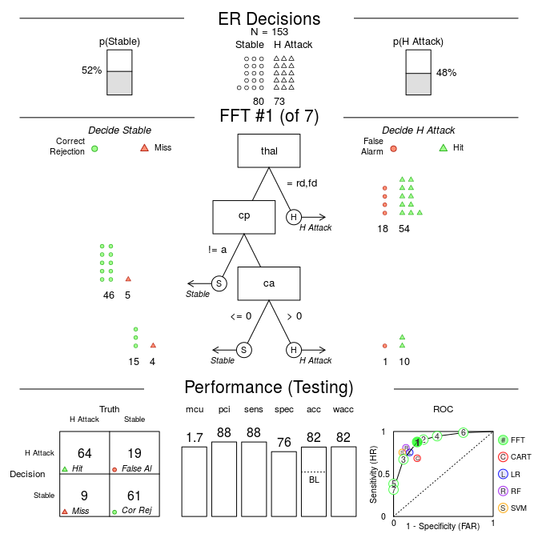
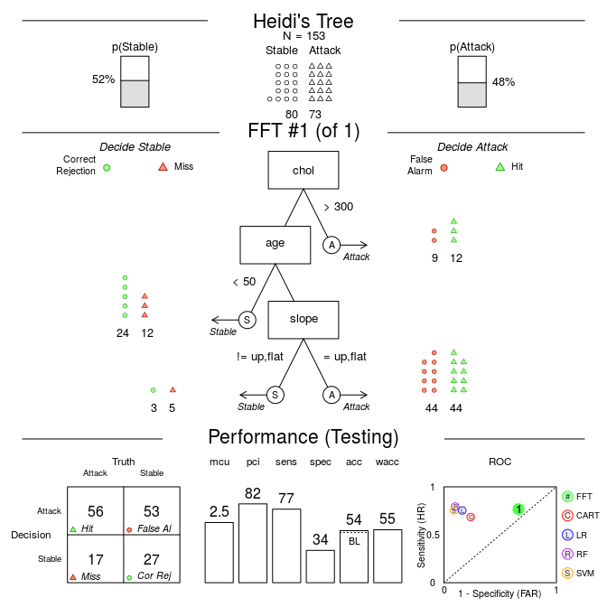

<!-- -->
------------------------------------------------------------------------

**Foreword**

- Code snippets and excerpts from the tutorial. From DataCamp.
- Open the [HTML file](Fast-and-Frugal_Decision_Trees_in_R_with_FFTrees.html) in a new tab.

------------------------------------------------------------------------

Why?
====

Quickly decide: use an algorithm that can quickly understand and apply with minimal effort. For this reason, complex algorithms such as random forests, and even regression are not viable.

A fast-and-frugal tree is an extremely simple decision tree that anyone can easily understand, learn, and use to make fast decisions with minimal effort.

Explore the Heart Disease Data
==============================

The `FFTrees` package contains two datasets: `heart.train` to create (aka. train) fast-and-frugal trees, and `heart.test` to test their prediction performance.

    # Load the package
    library("FFTrees")

    # Print the first few rows of the training dataframe
    head(heart.train, 3)

    ##     age sex cp trestbps chol fbs     restecg thalach exang oldpeak slope
    ## 94   44   0 np      108  141   0      normal     175     0     0.6  flat
    ## 78   51   0 np      140  308   0 hypertrophy     142     0     1.5    up
    ## 167  52   1 np      138  223   0      normal     169     0     0.0    up
    ##     ca   thal diagnosis
    ## 94   0 normal         0
    ## 78   1 normal         0
    ## 167  1 normal         0

The train dataframe contains data from several patients, each categorized by demographic features such as age and sex, as well as the results of medical tests and measures such as their cholesterol level (`chol`) and their type of chest pain (`cp`). The key variable you want to predict is `diagnosis`, which is 1 for patients who are truly having heart attacks, and 0 for those who are not. The goal of your fast-and-frugal tree will be to find a few key variables in the data that can quickly and accurately predict diagnosis.

Create an `FFTrees` object
==========================

As with any algorithm, we need a function (formula), a train set, and a test set. We add a title and labels to the results.

    # Create an FFTrees object called `heart_FFT`
    heart_FFT <- FFTrees(formula = diagnosis ~ .,
                         data = heart.train,
                         data.test = heart.test,
                         main = "ER Decisions",
                         decision.labels = c("Stable", "H Attack"))

    # Print the summary statistics
    heart_FFT

    ## ER Decisions
    ## FFT #1 predicts diagnosis using 3 cues: {thal,cp,ca}
    ## 
    ## [1] If thal = {rd,fd}, predict H Attack.
    ## [2] If cp != {a}, predict Stable.
    ## [3] If ca <= 0, predict Stable, otherwise, predict H Attack.
    ## 
    ##                    train   test
    ## cases       :n    150.00 153.00
    ## speed       :mcu    1.74   1.73
    ## frugality   :pci    0.88   0.88
    ## accuracy    :acc    0.80   0.82
    ## weighted    :wacc   0.80   0.82
    ## sensitivity :sens   0.82   0.88
    ## specificity :spec   0.79   0.76
    ## 
    ## pars: algorithm = 'ifan', goal = 'wacc', goal.chase = 'bacc', sens.w = 0.5, max.levels = 4

`thal` is either `rd` or `fd`, the dependent variable `H Attack`. `cp` is not equal to `a` and the model has converged towards an optimum (`Stable`). The tree used an average of 1.74 pieces of information to classify cases with the train set. The tree has then an accuracy of 82% with the test set.

Plotting Fast-And-Frugal Trees
==============================

The visualization greatly improves the understanding.

    # Visualise the tree applied to the test data heart.test
    plot(heart_FFT, data = "test")

-   On the top row, you can see that there were 153 patients (cases) were in the training data, where 73 patients were truly having heart attacks (48%), and 80 patients were not (52%).
-   In the middle row, you see exactly how the tree makes decisions for each of the patients using easy--to--understand icon arrays. For example, you see that 72 patients suspected of having heart attacks were (virtually) sent to the CCU after the first question, where 18 were not having heart attacks (false--alarms), and 54 were having heart attacks (hits).
-   In the bottom row of the plot, you can see aggregate summary statistics for the tree. On the bottom row, you have a 2 x 2 confusion matrix, which shows you a summary of how well the tree was able to classify patients, levels indicating overall summary statistics, and an ROC curve which compares the accuracy of the tree to other algorithms such as logistic regression (LR) and random forests (RF). Here, where the fast-and-frugal tree is represented by the green circle "1", you can see that the fast-and-frugal tree had a higher sensitivity than logistic regression and random forests, but at a cost of a lower specificity.

Creating and Testing a Custom Tree
==================================

We can easily describe fast-and-frugal trees 'in words': "A better rule would be to use the cues cholesterol, age, and slope."

1.  If cholesterol &gt; 300, decide Heart Attack.
2.  If age &lt; 50, decide Stable.
3.  If slope is either up or flat, predict Attack, otherwise,
    predict Stable.

<!-- -->

    # Create Heidi's custom FFT
    custom_FFT <- FFTrees(formula = diagnosis ~ .,               
                          data = heart.train,                    
                          data.test = heart.test,                
                          main = "Heidi's Tree",                  
                          decision.labels = c("Stable", "Attack"),
                          my.tree = "If chol > 300, predict Attack.
                                     If age < 50, predict Stable.
                                     If slope = {up, flat} predict Attack. Otherwise, predict Stable.")

    # Print the summary statistics
    custom_FFT

    ## Heidi's Tree
    ## FFT #1 predicts diagnosis using 3 cues: {chol,age,slope}
    ## 
    ## [1] If chol > 300, predict Attack.
    ## [2] If age < 50, predict Stable.
    ## [3] If slope != {up,flat}, predict Stable, otherwise, predict Attack.
    ## 
    ##                    train   test
    ## cases       :n    150.00 153.00
    ## speed       :mcu    2.41   2.49
    ## frugality   :pci    0.83   0.82
    ## accuracy    :acc    0.59   0.54
    ## weighted    :wacc   0.61   0.55
    ## sensitivity :sens   0.80   0.77
    ## specificity :spec   0.42   0.34
    ## 
    ## pars: algorithm = 'ifan', goal = 'wacc', goal.chase = 'bacc', sens.w = 0.5, max.levels = 4

    # Plot Heidi's tree and accuracy statistics
    plot(custom_FFT, data = "test")

The new tree is much, much worse than the tree the internal algorithm came up with. While the tree generated by FFTrees had an overall accuracy of 82%, the new tree is only 54% accurate!

Moreover, you can see very few patients (only 21) are classified as having a heart attack after the first node based on their cholesterol level, and of those, only 12 / 21 (57%) were really having heart attacks. In contrast, for the tree created by `FFTrees`, a full 72 patients are classified after the first node based on their value of `thal`, and of these, 75% were truly having heart attacks.

More
====

We can use trees to predict classes (and their probabilities) for new datasets, and create trees that minimise different classification error costs (for example, when the cost of a miss is much higher than the cost of a false alarm).

Check out the package vignette by running `FFTrees.guide()`.

    FFTrees.guide()

Summary
=======

Fast-and-frugal decision trees are great options when you need a simple, transparent decision algorithm that can easily be communicated and applied, either by a person or a computer.

Although fast-and-frugal trees are great for medical decisions (Green & Mehr, 1997), they can be created from any dataset with a binary criterion, from predicting whether or not a bank will fail (Neth et al., 2014), to predicting a judge's bailing decisions (Dhami & Ayton, 2001).

- Dhami, Mandeep K, and Peter Ayton. 2001. "Bailing and Jailing the Fast and Frugal Way." Journal of Behavioral Decision Making 14 (2). Wiley Online Library: 141 - 168.
- Galesic, Mirta, Rocio Garcia-Retamero, and Gerd Gigerenzer. 2009. "Using Icon Arrays to Communicate Medical Risks: Overcoming Low Numeracy." Health Psychology 28 (2). American Psychological Association: 210.
- Green, Lee, and David R Mehr. 1997. "What Alters Physicians' Decisions to Admit to the Coronary Care Unit". Journal of Family Practice 45 (3). [New York, Appleton-Century-Crofts]: 219 - 226.
- Martignon, Laura, Oliver Vitouch, Masanori Takezawa, and Malcolm R Forster. 2003. "Naive and yet Enlightened: From Natural Frequencies to Fast and Frugal Decision Trees." Thinking: Pychological Perspectives on Reasoning, Judgment and Decision Making. John Wiley & Sons, Ltd, 189 - 211.
- Neth, Hansjörg, Björn Meder, Amit Kothiyal, and Gerd Gigerenzer. 2014. "Homo Heuristicus in the Financial World: From Risk Management to Managing Uncertainty." Journal of Risk Management in Financial Institutions 7 (2). Henry Stewart Publications: 134 - 144.
- Phillips, Nathaniel D, Hansjörg Neth, Jan K Woike, and Wolfgang Gaissmaier. 2017. "FFTrees: A Toolbox to Create, Visualize, and Evaluate Fast-and-Frugal Decision Trees." Judgment and Decision Making 12 (4). Society for Judgment & Decision Making: 344.
