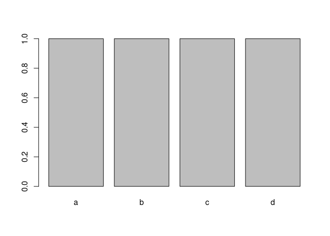
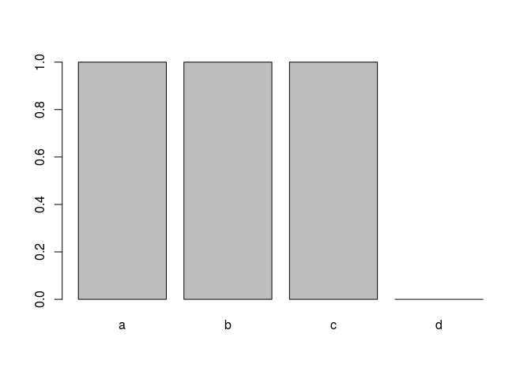
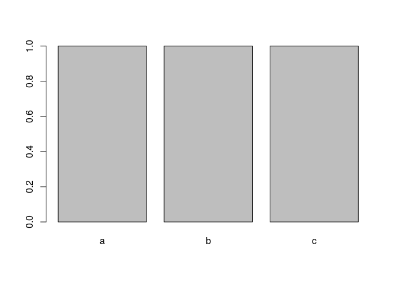

[TOC]

------------------------------------------------------------------------

**Foreword**

Code snippets and excerpts from the tutorial. From DataCamp.

------------------------------------------------------------------------

Create a sequence
=================

    # Sequence a vector
    x <- runif(10)
    seq(x)

    ##  [1]  1  2  3  4  5  6  7  8  9 10

    # Sequence an integer
    seq(nrow(mtcars))

    ##  [1]  1  2  3  4  5  6  7  8  9 10 11 12 13 14 15 16 17 18 19 20 21 22 23
    ## [24] 24 25 26 27 28 29 30 31 32

Create a vector
===============

`vector("type", length)` improves memory usage and increases speed over
`c()`. Know upfront what type of values will go into a vector, and how
long the vector will be.

    # A numeric vector with 5 elements
    vector("numeric", 5)

    ## [1] 0 0 0 0 0

    # A character vector with 3 elements
    vector("character", 3)

    ## [1] "" "" ""

    n <- 5
    x <- vector("integer", n)
    for (i in seq(n)) {
      x[i] <- i
    }
    x

    ## [1] 1 2 3 4 5

A speed test
------------

    n <- 1e5

    x_empty <- c()
    system.time(for(i in seq(n)) x_empty <- c(x_empty, i))

    ##    user  system elapsed 
    ##  15.724   0.000  15.724

    x_zeros <- vector("integer", n)
    system.time(for(i in seq(n)) x_zeros[i] <- i)

    ##    user  system elapsed 
    ##   0.012   0.000   0.011

Which
=====

Is it par of the series, vector? What value?

    x <- 3:7

    # Using which (not necessary)
    x[which(x > 5)]

    ## [1] 6 7

    # No which
    x[x > 5]

    ## [1] 6 7

    # Using which
    length(which(x > 5))

    ## [1] 2

    # Without which
    sum(x > 5)

    ## [1] 2

    condition <- x > 5

    condition

    ## [1] FALSE FALSE FALSE  TRUE  TRUE

    x[condition]

    ## [1] 6 7

    sum(condition)

    ## [1] 2

    mean(condition)

    ## [1] 0.4

    which(condition)

    ## [1] 4 5

    x <- c(1, 2, 12)

    # Using `which()` and `length()` to test if any values are greater than 10
    if (length(which(x > 10)) > 0)
      print("At least one value is greater than 10")

    ## [1] "At least one value is greater than 10"

    # Wrapping a boolean vector with `any()`
    if (any(x > 10))
      print("At least one value is greater than 10")

    ## [1] "At least one value is greater than 10"

    # Using `which()` and `length()` to test if all values are positive
    if (length(which(x > 0)) == length(x))
      print("All values are positive")

    ## [1] "All values are positive"

    # Wrapping a boolean vector with `all()`
    if (all(x > 0))
      print("All values are positive")

    ## [1] "All values are positive"

Factor
======

The simple way to remove values from a factor.

Starting with.

    # A factor with four levels
    x <- factor(c("a", "b", "c", "d"))
    x

    ## [1] a b c d
    ## Levels: a b c d

    plot(x)

The problem.

    # Drop all values for one level
    x <- x[x != "d"]

    # But we still have this level!
    x

    ## [1] a b c
    ## Levels: a b c d

    plot(x)

The solution.

    # Drop all values for one level
    x <- factor(x[x != "d"])
    x

    ## [1] a b c
    ## Levels: a b c

    plot(x)

Extract from a data.frame
=========================

Simple and fast.

    # rows first, column second - not ideal
    mtcars[mtcars$cyl == 4, ]$hp

    ##  [1]  93  62  95  66  52  65  97  66  91 113 109

    # column first, rows second - much better
    mtcars$hp[mtcars$cyl == 4]

    ##  [1]  93  62  95  66  52  65  97  66  91 113 109

A speed test
------------

    # Simulate a data frame...
    n <- 1e7
    d <- data.frame(
      a = seq(n),
      b = runif(n)
    )

    # rows first, column second - not ideal
    system.time(d[d$b > .5, ]$a)

    ##    user  system elapsed 
    ##   0.568   0.096   0.663

    # column first, rows second - much better
    system.time(d$a[d$b > .5])

    ##    user  system elapsed 
    ##   0.104   0.012   0.114

------------------------------------------------------------------------
