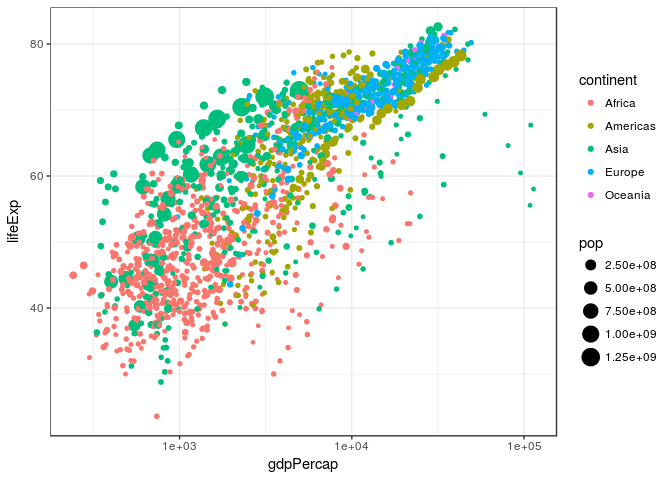
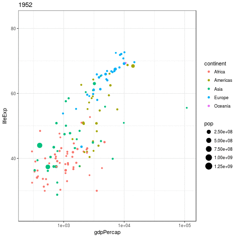
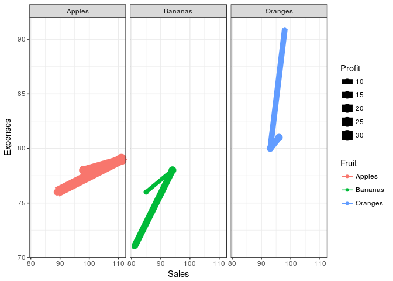
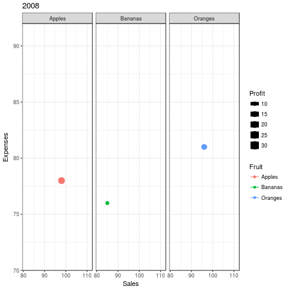

<!-- -->
------------------------------------------------------------------------

**Foreword**

- Snippets and results.

------------------------------------------------------------------------

The `gganimate` package
=======================

The [package](https://github.com/dgrtwo/gganimate) does not make interactive charts, but introduces a time dimension in the display of static charts.

Static chart
============

We add a time dimension with `frame = year`. However, we are not using it and the data points look bunched up!

    library(gapminder)
    library(ggplot2)
    theme_set(theme_bw())

    p <- ggplot(gapminder, aes(gdpPercap, lifeExp, size = pop, color = continent, frame = year)) +
      geom_point() +
      scale_x_log10()

    p

Dynamising a static chart
=========================

Moving frames can turn into a motion pictures! Let's use `frame = year`.

    library(gganimate)

    gganimate(p)

We can see the results further down.

Saving the animation
====================

    gganimate(p, "img/gganimate/output.mp4")
    gganimate(p, "img/gganimate/output.swf")
    gganimate(p, "img/gganimate/output.html")

    gganimate(p, "output.gif")

Rendering the animation (.gif):

And again...
============

    library(googleVis)

    head(Fruits, 3)

    ##    Fruit Year Location Sales Expenses Profit       Date
    ## 1 Apples 2008     West    98       78     20 2008-12-31
    ## 2 Apples 2009     West   111       79     32 2009-12-31
    ## 3 Apples 2010     West    89       76     13 2010-12-31

    library(ggplot2)
    library(gganimate)

    Fruits_a <- ggplot(Fruits, aes(x=Sales, y=Expenses, size = Profit, color = Fruit, frame = Year)) +
      geom_point() +
      geom_path(aes(cumulative = TRUE, group = Fruit)) +
      facet_wrap(~Fruit)

    Fruits_a

    gganimate(Fruits_a, interval = 5)

    gganimate(Fruits_a, "Fruits_a.gif")

Rendering the animation (.gif):

